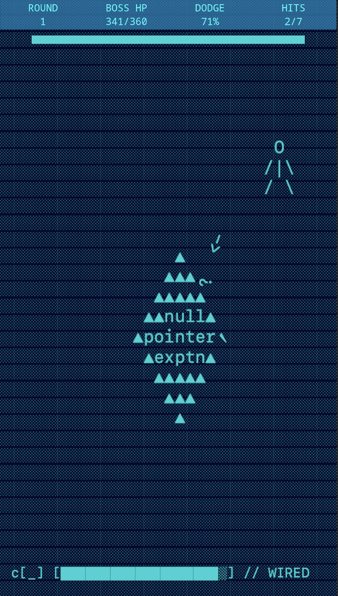

# Block Survivor - Unity Game Client

> AI-powered survival game with real-time difficulty adjustment  
> **EthGlobal Cannes 2025 Submission**

  

## 🎮 Game Overview

Block Survivor is a top-down survival game where you play as a developer fighting code bugs at 3 AM. Battle Null Pointer Exceptions, Stack Overflow errors, and Memory Leaks while an AI system analyzes your performance and adapts the game difficulty in real-time.



### 🌟 Key Features

- **Developer-Themed Gameplay**: Fight actual code bugs with programming humor
- **Sketch Art Style**: Hand-drawn aesthetic appealing to developers
- **Real-time Metrics**: Tracks APM, dodge rate, reaction time, movement patterns
- **AI Integration**: Connects to decentralized AI for dynamic difficulty adjustment
- **Adaptive Terrain**: Smooth (slippery), Sticky (slow), Rugged (balanced)
- **Dynamic Boss Scaling**: AI adjusts speed, health, damage, shield

## 🚀 Quick Start

### Prerequisites

- Unity 2023.x or later
- TextMeshPro package

### Setup

1. **Clone the repository**

   ```bash
   git clone <your-unity-repo-url>
   cd block-survivor-unity
   ```

2. **Open in Unity**

   - Open Unity Hub
   - Add project from disk
   - Select the cloned folder

3. **Configure API Endpoint**

   - Open `Scripts/API/GameAPIConfig.cs`
   - Update `API_BASE_URL` with your server:

   ```csharp
   public static readonly string API_BASE_URL = "https://your-api-url.com/api";
   ```

4. **Build and Run**
   - File → Build Settings
   - Select your platform (WebGL recommended)
   - Build and Run

## 🎯 How It Works

1. **Game Start**: Unity requests a new session from the AI API
2. **Gameplay Loop**: Collect player metrics every 30 seconds
3. **AI Analysis**: Send metrics to decentralized AI for difficulty analysis
4. **Real-time Adaptation**: Apply new terrain and boss configurations
5. **Enhanced Experience**: Maintain optimal challenge for each player

## 🤖 AI Integration

### Metrics Collected

- **APM (Actions Per Minute)**: Player input frequency
- **Dodge Ratio**: Percentage of attacks successfully avoided
- **Movement Distance**: Total distance traveled
- **Reaction Time**: Average response time to threats
- **Damage Dealt**: Total damage to enemies

### Configuration Applied

- **Terrain Changes**: Affects movement speed and control
- **Boss Scaling**: Adjusts difficulty parameters in real-time
- **Challenge Balance**: Maintains optimal player engagement

## 🎨 Art & Design

- **Hand-drawn Aesthetic**: Sketch-style visuals
- **Developer Humor**: Code bugs as enemies, programming references
- **Monospace Typography**: Terminal-inspired UI
- **Color Palette**: Charcoal lines, terminal green accents, error red

## 🔧 Configuration

### API Settings (`GameAPIConfig.cs`)

```csharp
public static readonly string API_BASE_URL = "your-api-endpoint";
public static readonly float METRICS_INTERVAL = 30f; // seconds
public static readonly int MAX_RETRIES = 3;
```

### Game Settings (`GameSettings.cs`)

```csharp
public float playerSpeed = 5f;
public float bulletSpeed = 10f;
public int maxHealth = 100;
```

## 🧪 Testing

### Local Testing

- Use `http://localhost:4000/api` for local API server
- Enable debug logs in Unity Console
- Test with different player behaviors

### Production Testing

- Update API endpoint to your deployed server
- Test WebGL build thoroughly
- Verify HTTPS compatibility

## 🚨 Known Issues

- **AI Integration**: Currently in development, may fallback to static difficulty
- **WebGL Performance**: Some features may be limited on web builds
- **Network Latency**: API calls may take 15+ seconds for AI responses

## 🤝 Contributing

1. Fork the repository
2. Create a feature branch
3. Commit your changes
4. Push to the branch
5. Open a Pull Request

## 📄 License

This project is licensed under the MIT License - see the [LICENSE](LICENSE) file for details.

## 🏆 EthGlobal Cannes 2025

Block Survivor was created for EthGlobal Cannes 2025, demonstrating:

- **Decentralized AI Gaming**: First real-time adaptive game using 0G Network
- **Web3 Integration**: Fluence VM hosting, blockchain-based AI
- **Developer Appeal**: Built for the developer community

## 🔗 Related Links

- **API Repository**: [Block Survivor API](https://github.com/npanium/block-survivor-api)
- **Live Demo**: [Play Block Survivor](your-game-url)
- **API Documentation**: [API Docs](your-api-url/docs)

---

**Built with ❤️ for EthGlobal Cannes 2025**  
**Powered by Unity, 0G Network, and Fluence**
